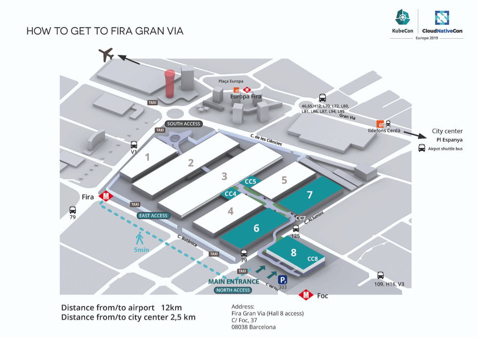
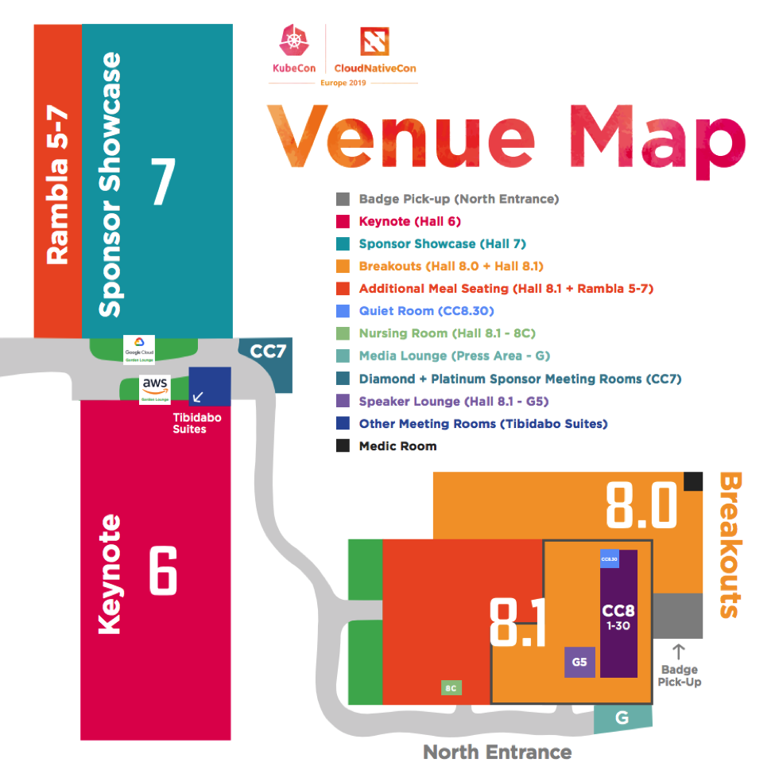

#Finding Important Locations

Knowing the layout of the venue and the location of key rooms and facilities can help make the conference experience much more comfortable and relaxing. Check the conference and venue websites for maps.

##Venue Information
Fira Gran Via, Hall 8
Carrer de l’Alumini, s/n
08908 Barcelona, Spain
The Gran Via at Fira Barcelona is located in a new business development area close to Barcelona airport and connected to the public transport network:
[https://www.firabarcelona.com/en/como-llegar-gran-via](https://www.firabarcelona.com/en/como-llegar-gran-via)

The venue is easily accessible for those traveling in just for the event or extending their adventure. Please note that the event is taking place on the north end of the venue so access will be limited to the North Entrance at Hall 8.

The conference venue website has a floor plan of Hall 8:
[http://www.firabarcelona-guestevents.com/files/files/gv-hall-8-0.pdf](http://www.firabarcelona-guestevents.com/files/files/gv-hall-8-0.pdf)

It's also a good idea to take a look at a map of the area around the conference venue:
[https://www.firabarcelona.com/en/como-llegar-gran-via](https://www.firabarcelona.com/en/como-llegar-gran-via)

Some key locations you may want to find are:

- Badge Pick-up: North Entrance Foyer, Hall 8.0
- Keynote: Hall 6
- Sponsor Showcase: Hall 7
- Breakouts: Hall 8.0 + Hall 8.1
- Additional Meal Seating (Hall 8.1 + Rambla 5-7)
- Quiet Room: CC8.30
- Nursing Room: Hall 8.1 - 8C
- Media Lounge: Press Area G
- Diamond + Platinum Sponsor Meeting Rooms: CC7
- Speaker Lounge: Hall 8.1 - G5
- Medic Room: Hall 8.0
- Bathrooms
- The Open Sourcing Mental Illness (OSMI) Booth: Booth #SE15 
- Well-Being Activities
- Party or Social Locations for the Conference

##Quiet Room

Location: Fira Gran Via Room CC8.30, Hall 8.1
All attendees may feel free to use the Quiet Room as needed. It is a physical space where conversation and interaction are not allowed, where attendees can go if for any reason they can’t interact with other attendees at that time.

##Nearby Stores

Knowing where you can get basic supplies, medicines, clothing, etc. can be very helpful. Here are a list of stores that may be useful during a conference:
 
- [Grocery Store](https://goo.gl/maps/ZRq5BU8VJuRZSoTa6) - Not all conference food works for all people. If you have any food sensitivities or even if you just need some comfort food while you are away from home, knowing where the nearest grocery store is can help you stay fed and hydrated.
- [Pharmacy](https://goo.gl/maps/XNMogvFE24NNDnei8) - Traveling can be rough on your body. Traveling on airplanes, trains, and public transportation, not to mention surrounded by hundreds of strangers at a conference, leads to exposure to new germs and illnesses. If you come down with something while traveling, knowing where the nearest pharmacy is can insure you get the medicine that you need to get you back on your feet.
- [Clothing Store](https://goo.gl/maps/MLxifmBmLFP8P5Qf6) - It's always a good idea to know where you can get more clothing if you need to. You never know when someone is going to spill something on you or something rips in an awkward spot. If you are flying to the conference, there is always a chance that the airline will lose your luggage as well, so knowing where you can pick up a new shirt or pants can keep things moving smoothly.
- [Technology Store](https://goo.gl/maps/F78zrcDHNGEUdSGF6) - Cables break, adapters fail, chargers disappear - it is amazing how many different pieces of technology we need to keep us going, and knowing where to pick up a replacement if something breaks or disappears can be a lifesaver. 

